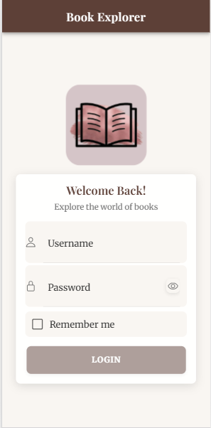
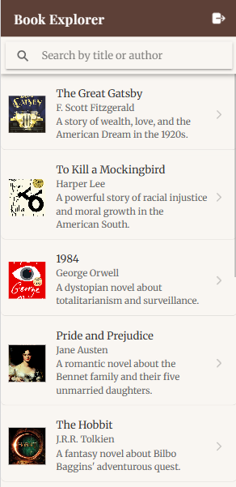
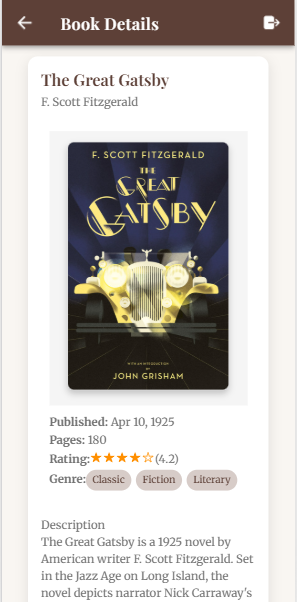

# 📚 Book Explorer App - Ionic + Angular  

**Assignment Submission** | Built with Ionic 7 + Angular (Standalone)  

## Features  
✅ Login with validation & "Remember Me"  
✅ Searchable book list  
✅ Book details with ratings/genres  
✅ Responsive mobile/desktop UI  
✅ Ionic Storage for session persistence 

## Test Credentials: user / pass123 

## Screenshots  
| Login Page | Book List | Book Details |  
|------------|-----------|--------------|  
|  ||  ||  |


## How to Run  
```bash
npm install
ionic serve


